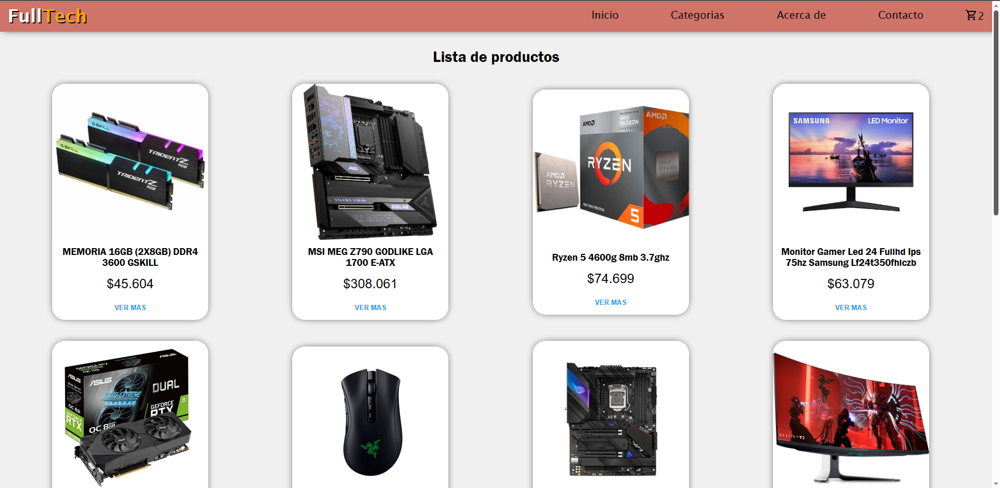

# FullTech

Bienvenido/a a FullTech, tu tienda en línea de componentes y periféricos de computadoras.

## Descripción

FullTech es una plataforma en línea especializada en la venta de una amplia gama de componentes y periféricos de computadoras. Nuestro objetivo es brindar a nuestros clientes productos de alta calidad y las últimas novedades tecnológicas para satisfacer sus necesidades informáticas.

## Características

- **Amplia selección de productos:** Explora nuestra extensa colección de componentes de computadoras, como procesadores, tarjetas gráficas, memorias RAM, discos duros, fuentes de alimentación, y más. También ofrecemos periféricos como teclados, ratones, monitores y auriculares.

- **Descripciones detalladas:** Proporcionamos descripciones detalladas de cada producto, incluyendo especificaciones técnicas y características destacadas.

- **Fácil navegación:** Nuestra interfaz de usuario intuitiva te permite encontrar rápidamente los productos que necesitas. Puedes filtrar por categorías.

- **Proceso de compra sencillo:** Realiza pedidos de forma rápida y segura a través de nuestro carrito de compras. Aceptamos diversos métodos de pago.

## Capturas de pantalla



## Funcionalidades

- **Filtrado por categorias** Desde el apartado "Categorias" podras visualizar una amplia variedad de categorias permitiendote seleccionarlas y de esta poder observar los diferentes productos de dicha categoria.

- **Contacto** Podras realizar tus consultas o quejas atraves del formulario proporcionado en la pestaña "Contacto", y a la brevedad nos pondremos en contacto.

## Librerias

Algunas de las librerias utilizadas fueron:

- **@mui/material** Utilizado para el apartado estetico en el form de contacto y modal del carrito.

- **@mui/icons-material** Implementado para agregarle el icono de carrito al boton para añadir productos y en la opcion para dirigirse al carrito.

- **firebase** Se utilizo para conectarse con la base de datos creada desde Cloud Firebase.

- **react-router-dom** Utilizada para crear las conexiones de las diferentes WebPages

## Instalación

No se requiere instalación para utilizar nuestra plataforma, ya que es una tienda en línea accesible a través de cualquier navegador web. Simplemente visita nuestro sitio web en [www.fulltech.com](https://www.fulltech.com) y comienza a explorar nuestra amplia selección de productos.

## Como levantar el proyecto

```
git clone https://github.com/AgustY-03/EntregaFinal-Yturre
npm install
npm run dev
```
---

¡Gracias por visitar FullTech! Esperamos que encuentres los componentes y periféricos que necesitas para mejorar tu experiencia informática. Si tienes alguna pregunta o necesitas asistencia, nuestro equipo de soporte está listo para ayudarte. ¡Disfruta de tu experiencia de compra en FullTech!
